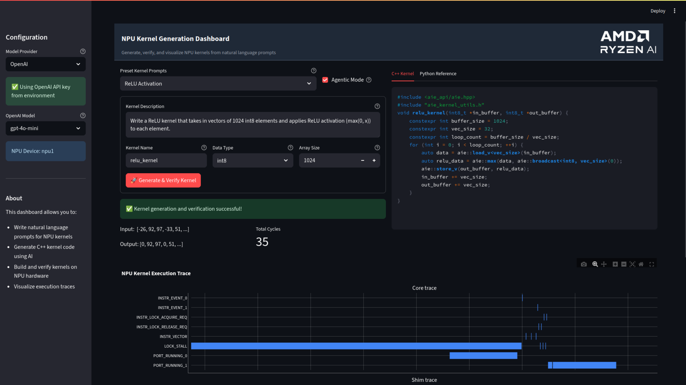

# NPU Kernel Generation Dashboard

This demo shows an example kernel generation pipeline that generates optimized NPU kernels as well as verification numpy implementations from prompts. It will automatically run your kernel and plot the trace profile.



Features:

- Vectorized C++ code generation from prompts that automatically runs on the NPU
- Agentic mode allows the LLM to re-try generation based on compiler feedback
- Automatic verification of NPU by comparing the output with dynamically generated Python reference code
- Live NPU data trace plottting

## Run dashboard

Easiest way to go is by using the start bash script:

```
./start_demo.sh
```

It will create a streamlit session with IP addresses you can copy-paste into your browser to access the dashboard. If you have an `OPENAI_API_KEY` or `ANTHROPIC_API_KEY` these will be automatically set as environment variables within the docker.

Alternatively if you're already in the npueval docker environment, you can manually run streamlit to launch the demo

```
streamlit run kernel_dashboard.py
```

The dashboard will have basic debug information if kernels fail, however more comprehensive logs will be printed out in the terminal where you launched the application.
