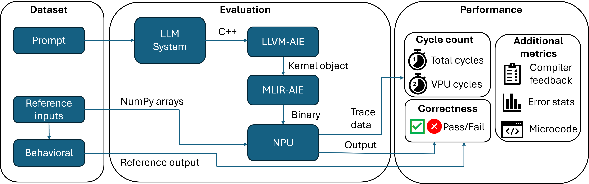
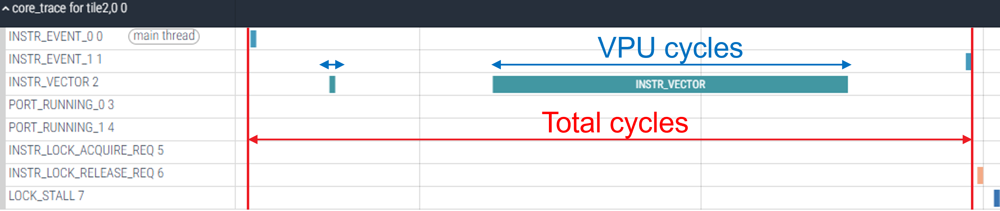
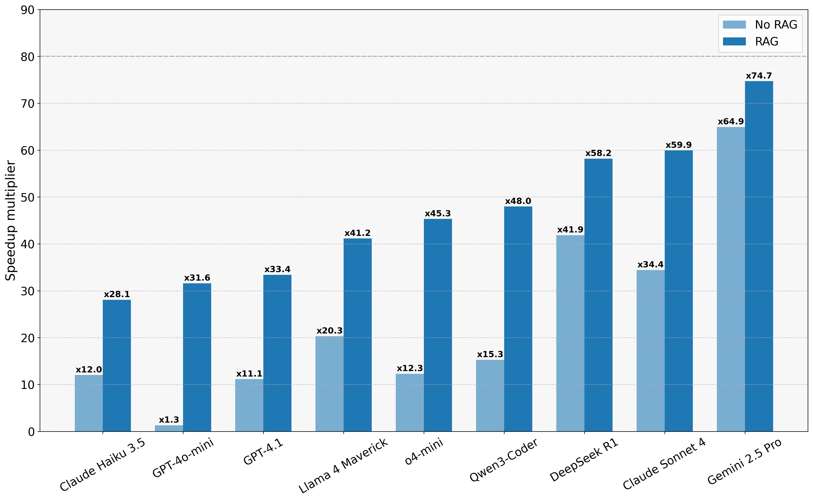
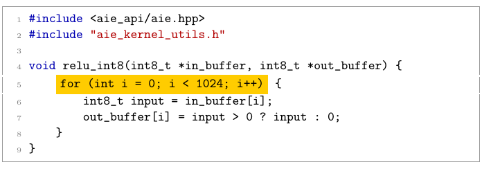
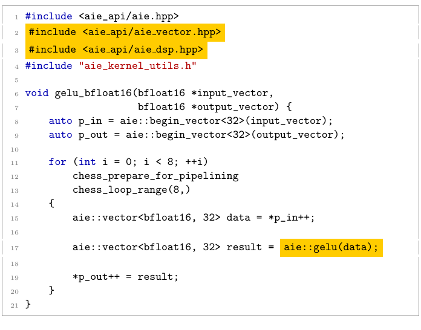
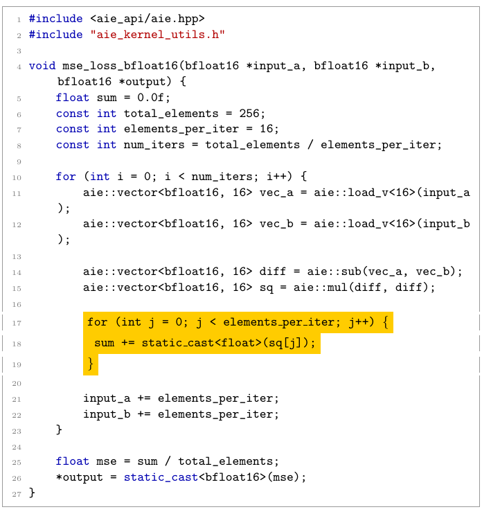

# NPUEval: the First LLM Benchmark for NPU Kernel Code Generation

Neural Processing Units (NPUs) are a new class of accelerator now commonly seen on client devices like laptops and miniPCs. They can perform compute dense operations and accelerate various AI workloads, but like any accelerator they need expert knowledge and expertise to reap the performance gains. 

AI assistants based on Large Language Models (LLMs) can do a decent job at writing code in various programming languages. Recently there have also been amazing related works on generating code for hardware acceleration, namely [Kernelbench](https://arxiv.org/abs/2502.10517), [TritonBench](https://arxiv.org/abs/2502.14752), [AI CUDA Engineer](https://pub.sakana.ai/ai-cuda-engineer) for GPUs. This is challenging enough for existing hardware frameworks, however NPU programming is new and there is a training data gap between application level code and this type of highly specialized hardware accelerator code. NPUEval is a benchmark that enables us to iterate on LLM-based systems that are good at writing optimized code, based entirely on open-source tooling.

## Why NPU Programming is Hard

GPU programming investigated in previous works has had years to mature with established communities and extensive documentation. NPU programming on the other hand is still in its infancy. Developer communities are smaller and fragmented across different hardware platforms, meaning there's less optimized code available for LLMs to learn from during training.

Writing efficient NPU kernels requires understanding vectorization – processing chunks of data simultaneously rather than one element at a time. To build intuition here's a very simple passthrough kernel example:

**Scalar (inefficient) approach:**
```cpp
void passthrough(uint8_t *in_buffer, uint8_t *out_buffer){
    uint32_t nbytes = 512;
    for (int i=0; i<nbytes; i++) {
        out_buffer[i] = in_buffer[i];
    }
}
```

**Vectorized (efficient) approach:**
```cpp
void passthrough(uint8_t *in_buffer, uint8_t *out_buffer){
    uint32_t loop_count = 8; // 512/64
    for (int i = 0; i < loop_count; i++) {
        auto buffer = ::aie::load_v<64>(in_buffer);
        ::aie::store_v(out_buffer, buffer);
        in_buffer += 64;
        out_buffer += 64;
    }
}
```

The vectorized version processes 64 bytes per cycle instead of one, dramatically improving performance. While this is more of a toy example it sets the scene of how we think about writing optimized kernels - we want to process a lot of data in parallel efficiently.

## Introducing NPUEval

### The Dataset

The NPUEval dataset is a collection of prompts consisting of AIE kernel definitions accompanied with docstrings containing the kernel description, input/output examples, and anticipated data movement and runtime parameters. Here's a example prompt for a relu6 kernel:

```cpp
/*
This AIE kernel applies the ReLU6 activation function elementwise to a bfloat16 input vector of size 256. ReLU6 clamps each value to [0, 6].
>>> relu6_bfloat16([12.125, 1.203125, 5.84375, 15.9375, 12.9375, -9.8125, 5.59375, -3.203125])
[6.0, 1.203125, 5.84375, 6.0, 6.0, 0.0, 5.59375, 0.0]
This kernel should be optimized for the following input/output buffer shapes and parameters:
input size: 256
output size: 256
*/
#include <aie_api/aie.hpp>

void relu6_bfloat16(bfloat16 *input, bfloat16 *output) {
    // Implementation goes here
}
```

Each kernel in the dataset will have the following components:
- **Prompt** - HumanEval-inspired prompts containing a basic explanation of what the kernel does and function signature.
- **Data movement information** - specifying the data sizes coming in and out of the tile.
- **Behavioral model** - NumPy-based Python implementation of the target kernel.
- **Test vectors** - the reference input and output NumPy arrays used to verify functional correctness.

### Evaluation

The generated kernels are evaluated using the following criteria:

- **Compilation** - does the kernel compile? Is it syntactically correct C++ code using valid NPU vector unit API calls and intrinsics?
- **Functional correctness** - does the kernel produce the correct output for the given input (given a provided error tolerance)?
- **Performance** - how long does the kernel take to execute and how efficiently is the vector processing unit (VPU) utilized?



<p style="text-align: center"><strong>Figure 1:</strong> NPUEval evaluation pipeline overview</p>

The dataset includes kernel prompts, behavioral models and test vectors. The evaluation harness compiles the generated C++ kernel code and runs it on-target. The outputs are then compared against the expected simulation outputs from the Python behavioral models.

## How do we know if the kernels are any good?

These days it's trivial to generate copious amounts of LLM generated code using APIs from various providers. The two main metrics we're after in our evaluation harness are functional correctness and performance (how efficient are the generated kernels).

### Functional Correctness

The primary thing we care about is whether the kernels are **functionally** sound. Do the NPU outputs match our Python-generated reference values (within an acceptable threshold)?

This is trivial to evaluate since we've abstracted all the memory management, buffer allocation, and device programming with simple function calls acting on NumPy arrays. We can get pass/fail for a single kernel test by comparing the arrays:

```Python
# Check if results are within tolerance
result = np.allclose(reference, npu_output,
                     rtol=self.rtol,
                     atol=self.atol)
```

### Kernel Efficiency

If the kernel is functionally correct, then the metric we care about is the time it takes to run our kernel on a particular workload - the faster the better. Sounds simple. However when generating NPU kernels we run into one issue - there are very few of them out there. This means we do not have solid baselines to compare our results against.

A solution we ended up using as a proxy for efficiency was utilizing trace data. By tracking how many cycles of computation was spent using the VPU vs total cycles we calculate a vectorization score:

$$\text{vector score} = \frac{\text{vpu cycles}}{\text{total cycles}}$$



<p style="text-align: center"><strong>Figure 2:</strong> Optimized kernel trace data.</p>

Now this isn't a perfect solution because, for some kernels, scalar unit operations are unavoidable and not everything can be parallelized neatly - you'll never achieve 100% vectorization, and typically reaching values of 30-50% is considered really good. However this works well as an approximation since scalar (unoptimized) kernels will often end up with a score of 0%, utilizing none of the parallel processing capabilities of the core!

### Speedup relative to baseline kernels

The NPUEval dataset comes with 102 unoptimized C++ implementations of reference kernels. We use these as part of CI to make sure that the code evaluation pipeline works. Since each NPU compute tile contains a scalar processing unit alongside a VPU, it can run regular C++ code with no vector operations. We compare the generated kernels against these baseline implementations and report out the speedup multiplier (how many times the generated kernel is faster than the unoptimized baseline).

$$\text{speedup multiplier} = \frac{\text{total cycles (baseline)}}{\text{total cycles (generated kernel)}}$$

Note that the difference between unoptimized and vectorized kernels can result in as much as a 300x improvement. This is why our speedup results tend to be very large numbers for this benchmark.

## Out-of-the-box LLM evaluation

We first set the baseline results for the models by testing them on the prompts directly (no compiler feedback, no prompt engineering). The one-shot results are summarized in Figure 3. below.

::::{grid} 2
:::{grid-item}
:columns: 6

```{image} img/outofbox_functional.png
:width: 380px
```

<p style="text-align: center">(a) Functional results</p>

:::
:::{grid-item}
:columns: 6

```{image} img/outofbox_vector.png
:width: 380px
```

<p style="text-align: center">(b) Vectorization score</p>

:::
::::

::::{grid} 1
:::{grid-item}

```{image} img/outofbox_speedup.png
:width: 380px
:align: center
```

<p style="text-align: center">(c) Relative speedup over baseline</p>

:::
::::

<p style="text-align: center"><strong>Figure 3:</strong> Zero-shot results (ranked from top to bottom)</p>

**Functional correctness** It was quite striking to see GPT-4o-mini nearly topping the functional test score - outperforming much more powerful models even within its own family (GPT-4.1, o4-mini). We found this to be a general trend with weaker models - as they tend to not optimize and go for the simplest scalar solutions, which leaves little room for error when producing a functionally correct kernel.

**Vectorization** Looking at the vectorization scores the story is entirely different. The average VPU utilization was much higher coming from more powerful models like Claude Sonnet 4, Gemini 2.5 Pro and DeepSeek R1, and in this case - as expected - stronger GPT models like GPT-4.1 now outperformed their less capable counterparts. Albeit the vectorization levels are low across all models.

Strong models tend to *try* optimization, however they tend to hallucinate non-existent APIs or misuse vector ops. We hypothesize that this happens due to lack of NPU programming examples in pre-training data.

**Speedup** Now let's look at the relative speedup of the generated kernels. Figure 3 (c) shows us that Claude 4 tops the chart again (this was surprising because it also performed best on functional tests!).

To build intuition on the speedup score consider this example: 1 out of 102 kernels passes with a speedup of 204x. The final score (average speedup) will be $204/102 = 2$. So even though only a single generated kernel passed the tests it's still a 2x average improvement over baseline.

## Pass@k results

To explore the effects that the random nature of LLMs have on the produced solutions we run a series of tests with using a strong GPT model (GPT-4.1) and a weak one (GPT-4o-mini). All experiments run with temperature $T=0.4$.

::::{grid} 2
:::{grid-item}
:columns: 6

```{image} img/pass_at_k.png
:width: 400px
```

<p style="text-align: center">(a) Functional results</p>

:::
:::{grid-item}
:columns: 6

```{image} img/speedup_at_k.png
:width: 400px
```

<p style="text-align: center">(b) Speedup results</p>

:::
::::

<p style="text-align: center"><strong>Figure 4:</strong> Contrasting a weak and strong model with pass@k results.</p>

An interesting observation is that even though both models plateau on the functional tests, looking at the speedup we see only the weaker model plateauing. Higher capacity, powerful models are more likely to produce optimized kernels using AIE APIs hence scaling with $k$ speedup increased even if functional correctness didn't necessarily improve. 

We did not observe the same behavior from the smaller model - even though it generates more functionally correct kernels, scaling $k$ does not improve performance. This suggests that while a smaller model can produce correct code more often, it lacks the capacity to consistently exploit parallelism and specialized intrinsics, so increasing $k$ simply yields more of the same baseline-quality kernels rather than progressively accumulating faster ones.

## Adding Compiler Feedback and Vectorization Examples

We added compiler feedback into the pipeline and a small collection of vectorized examples for Retrieval Augmented Generation (RAG). Check out the reference code how to set it up in our [github repo](https://github.com/AMDResearch/NPUEval/blob/main/scripts/run_completions.py). By default every model had 10 recompilation attempts and had the most relevant vectorized kernel added as context - just showing the LLM how to use the APIs was very useful in producing code that better utilized the APIs.

All results below in Figure 5. have been produced with greedy decoding at $T=0.0$ and 10 recompilation attempts. We display results both with RAG and without.



<p style="text-align: center"><strong>Figure 5:</strong> Performance comparison across models</p>

As expected with the addition of RAG most models produced more optimized kernels according to the average speedup over baseline kernels. The best performance was achieved by Gemini 2.5 Pro overall with and **without** RAG. While DeepSeek R1 showed better out-of-the-box performance than Claude 4 Sonnet they seem to equally benefit from vectorization examples showing very similar speedup scores just below Gemini.

Previously we saw that scaling the number of solutions (k) for models like GPT-4o-mini resulted in a speedup plateau, however introducing vectorized examples and showing these models how to use the correct APIs, dramatically improved the performance of even the weakest models.

## Failure Analysis

We investigate some of the common failure modes across the models in instances where compilation failed, functional tests failed or performance was poor. Commonly seen problems are shown in Figure 6 below.

Some LLMs that passed many functional correctness tests ended up writing very inefficient solutions as shown, e.g., Figure 6(a) -- these kernels do not utilize the NPU hardware to the fullest. Incorrect solutions will fail compilation often due to hallucinations as shown in (b) or misunderstanding of how to use vector APIs as shown in (c), where the model has successfully used the AIE APIs but was still processing elements in a loop one by one, not fully vectorizing.

::::{grid} 2

:::{grid-item}
:columns: 6


(a) Looping one element at a time (Qwen3-Coder)


(b) Hallucinated non-existent headers and API calls (Gemini 2.5 Pro)
:::

:::{grid-item}
:columns: 6


(c) Aware of vectors and how to chop up the data but still processing in scalar loops (DeepSeek R1)

:::
::::

<p style="text-align: center"><strong>Figure 6:</strong> Examples of LLM errors in vectorized kernel generation: scalar loop with conditional (Qwen3-Coder), hallucinated API usage (Gemini 2.5 Pro) and incomplete vectorization (DeepSeek R1).</p>

More recent models like Gemini 2.5 Pro and Claude 4 seem to have baked in knowledge of AIE code optimization and even though they sometimes hallucinate APIs that do not exist, will try to produce optimized solutions. There is a great deal of potential in these models, however more work needs to be done on the generation pipelines via either context engineering or agentic workflows. As we've shown, simply adding compiler feedback can have tremendous performance improvements. And techniques like RAG and context engineering are very helpful in steering the LLMs towards more optimized solutions.

## Conclusions

We have introduced NPUEval - a challenging new benchmark for evaluating LLMs on their ability to generate NPU kernels. We found that weaker models such as GPT-4o-mini were really good at generating passing code, however they did not produce performant kernels and plateaued when being evaluated on speedup. We have shown that even weaker models, when provided with vectorized examples, can achieve performance comparable to their stronger counterparts.

Gemini 2.5 Pro was by far the best model at generating efficient kernels, alongside Claude 4 Sonnet and DeepSeek R1, with the best out-of-the-box understanding of AIE APIs. We believe that these models are very promising, especially when combined with agentic tooling and context engineering. We are excited to see how they will be used in future code generation pipelines to improve upon the results achieved in this work.

## What's Next

NPUs are still a new class of accelerator and it's impressive how good some models already are at writing code for them. This is only the beginning, and it will be exciting to see how new techniques, such as code-generating agents, will improve upon this benchmark.

The Python behavioral models can be re-used along with the infrastructure we have built here to generate datasets targeting any programming model. We plan to use the same methodology to extend this work to other accelerator families.

The benchmark and reference code generation pipeline are hosted on [github](https://github.com/AMDResearch/NPUEval) - if you have a Ryzen AI machine on hand, try to generate and run some NPU kernels yourself!