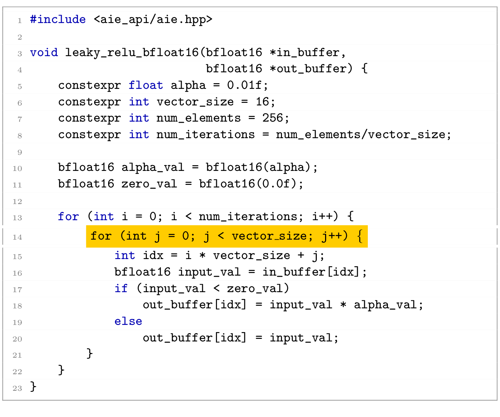

# NPUEval: the first LLM benchmark for NPU kernel code generation

Neural Processing Units (NPUs) are a new class of accelerator now commonly seen on client devices like laptops and miniPCs. They can perform compute dense operations and accelerate various AI workloads, but like any accelerator they need expert knowledge and expertise to reap the performance gains. These days AI assisitants based on Large Language Models (LLMs) do a very decent job at writitng passable code, however NPU programming is new and there is a training data gap between application level code and highly specialized hardware accelerator code. NPUEval is a benchmark that enables us to iterate on LLM-based systemss that are good at writing optimized code, based entirely on open-source tooling.

## The Challenge of NPU Programming

Unlike GPU programming, which has had years to mature with established communities and extensive documentation, NPU programming is still in its infancy. Developer communities are smaller and fragmented across different hardware platforms, meaning there's less optimized code available for LLMs to learn from during training.

Writing efficient NPU kernels requires understanding vectorization – essentially processing chunks of data simultaneously rather than one element at a time. Here's a simple example:

**Scalar (inefficient) approach:**
```cpp
for (int i=0; i<nbytes; i++) {
    out_buffer[i] = in_buffer[i];
}
```

**Vectorized (efficient) approach:**
```cpp
for (int i = 0; i < loop_count; i++) {
    buffer = ::aie::load_v64<>(in_buffer);
    ::aie::store_v(out_buffer, buffer);
    in_buffer += 64;
    out_buffer += 64;
}
```

The vectorized version processes 64 bytes per cycle instead of one, dramatically improving performance.

## Introducing NPUEval

### The Dataset

The NPUEval dataset is a collection of prompts consisting of AIE kernel definitions accompanied with docstrings containing the kernel description, input/output examples, and anticipated data movement and runtime parameters (see Appendix \ref{appendix_b} for more detail). An example prompt is shown in Fig. \ref{fig:prompt_sample}.

```cpp
/*
This AIE kernel applies the ReLU6 activation function elementwise to a bfloat16 input vector of size 256. ReLU6 clamps each value to [0, 6].
>>> relu6_bfloat16([12.125, 1.203125, 5.84375, 15.9375, 12.9375, -9.8125, 5.59375, -3.203125])
[6.0, 1.203125, 5.84375, 6.0, 6.0, 0.0, 5.59375, 0.0]
This kernel should be optimized for the following input/output buffer shapes and parameters:
input size: 256
output size: 256
*/
#include <aie_api/aie.hpp>

void relu6_bfloat16(bfloat16 *input, bfloat16 *output) {
    // Implementation goes here
}
```

Each kernel in the dataset will have the following components:
- **Prompt** - HumanEval-inspired prompts containing a basic explanation of what the kernel does and function signature.
- **Data movement information** - specifying the data sizes coming in and out of the tile.
- **Behavioral model** - NumPy-based Python implementation of the target kernel.
- **Test vectors** - the reference input and output NumPy arrays used to verify functional correctness.

### Evaluation

The generated kernels are evaluated using the following criteria:

- **Compilation** - does the kernel compile? Is it syntactically correct C++ code using valid NPU vector unit API calls and intrinsics?
- **Functional correctness** - does the kernel produce the correct output for the given input (given a provided error tolerance)?
- **Performance** - how long does the kernel take to execute and how efficiently is the VPU utilized?


The dataset includes kernel prompts, behavioral models and test vectors. The evaluation harness compiles the generated C++ kernel code and runs it on-target. The outputs are then compared against the expected simulation outputs from the Python behavioral models.

## Results

### Out-of-the-box LLM evaluation results

<table>
  <tr>
    <td style="text-align: center;">
      <br>
      <span>Figure 1: Functitonal results</span>
    </td>
    <td style="text-align: center;">
      <br>
      <span>Figure 2: Vectorization score</span>
    </td>
  </tr>
</table>

### Performance comparison


### Failure analysis

The LLMs that passed many functional correctness tests ended up writing very ineffient solutions as shown in Fig a -- these kernels do not utilize the NPU hardware to the fullest. Incorrect solutions will fail compilation often due to hallucinations as shown in Fig b or misunderstanding of how to use vector APIs as shown in Fig c where the model has successfully used the AIE APIs but was doing it in a loop one element at a time.

<table>
  <tr>
    <td width="48%">
      <br>
      <em>Figure A: Looping one element at a time (GPT-4o)</em><br><br>
      <br>
      <em>Figure B: Hallucinated non-existent API (Llama-3.1 70b)</em>
    </td>
    <td width="48%">
      <br>
      <em>Figure C: Aware of vectors and how to chop up the data but processing in scalar loops (Claude 3.7 Sonnet)</em>
    </td>
  </tr>
</table>

<p style="text-align: center"><strong>Figure:</strong> Examples of LLM errors in vectorized kernel generation: scalar loop with conditional (Claude 3.7 Sonnet), incomplete vectorization (GPT-4o), and hallucinated API usage (Llama-3.1 70b).</p>

There seems to be baked in knowledge in these models however, Claude 3.7 Sonnet (Fig c) does have a notion of vector\_size and that it should be chunking the input buffer into vectors of 16 elements. With more advanced prompting and more quality examples these models have the potential to write efficient NPU kernels.

## Future work


NPUs are still a new class of accelerator and its impressive how good some models already are at writing code for them. This is only the beginning and it will be exciting to see how new techniques like code generating agents will improve upon this benchmark.

While the work presented in this paper focused on one NPU architecture, this methodology could easily extend across different vendors and families of NPUs. The Python behavioral models can be re-used along with the PromptConstructor class to generate datasets targeting any programming model. We plan to use the same methodology to extend this work to other accelerator families.

## Conclusions

We have presented NPUEval, the first benchmark to systematically evaluate LLMs in their ability to generate NPU kernel code. NPUEval includes a comprehensive evaluation harness with cycle-accurate performance metrics and a reference code generation pipeline.

Our results show that most LLMs can readily generate scalar code, but struggle to produce optimized, vectorized solutions. Interestingly, smaller models (e.g., GPT-4o mini, Claude 3.5 Haiku) tend to favor functional but unoptimized code, while stronger models (e.g., GPT-4o, Claude 3.7 Sonnet, DeepSeek R1) attempt to optimize and risk hallucinations, leading to lower functional scores.

We believe NPUEval provides a valuable foundation for advancing LLM-driven accelerator kernel generation. We hope this benchmark will become the standard for measuring and improving LLM-based code generation for emerging hardware architectures.
