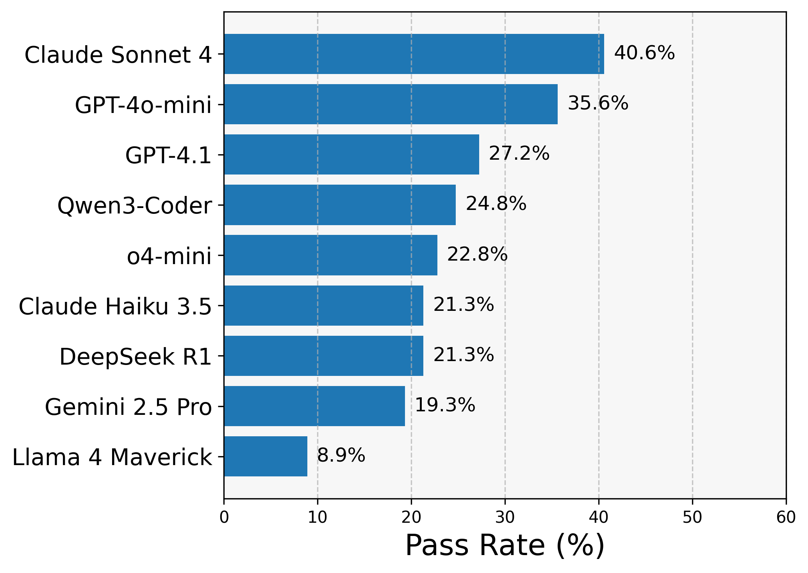

# NPUEval: the First LLM Benchmark for NPU Kernel Code Generation

Neural Processing Units (NPUs) are a new class of accelerator now commonly seen on client devices like laptops and miniPCs. They can perform compute dense operations and accelerate various AI workloads, but like any accelerator they need expert knowledge and expertise to reap the performance gains. 

These days AI assistants based on Large Language Models (LLMs) do a decent job at writing code in various programming languages. Recently there have also been amazing related works on generating code for hardware acceleration, namely [Kernelbench](https://arxiv.org/abs/2502.10517), [TritonBench](https://arxiv.org/abs/2502.14752), [AI CUDA Engineer](https://pub.sakana.ai/ai-cuda-engineer) for GPUs. This is challenging enough for existing hardware frameworks, however NPU programming is new and there is a training data gap between application level code and this type of highly specialized hardware accelerator code. NPUEval is a benchmark that enables us to iterate on LLM-based systems that are good at writing optimized code, based entirely on open-source tooling.

## Why NPU Programming is Hard

Unlike GPU programming, which has had years to mature with established communities and extensive documentation, NPU programming is still in its infancy. Developer communities are smaller and fragmented across different hardware platforms, meaning there's less optimized code available for LLMs to learn from during training.

Writing efficient NPU kernels requires understanding vectorization – processing chunks of data simultaneously rather than one element at a time. To build intuition here's a very simple passthrough kernel example:

**Scalar (inefficient) approach:**
```cpp
for (int i=0; i<nbytes; i++) {
    out_buffer[i] = in_buffer[i];
}
```

**Vectorized (efficient) approach:**
```cpp
for (int i = 0; i < loop_count; i++) {
    buffer = ::aie::load_v64<>(in_buffer);
    ::aie::store_v(out_buffer, buffer);
    in_buffer += 64;
    out_buffer += 64;
}
```

The vectorized version processes 64 bytes per cycle instead of one, dramatically improving performance. While this is more of a toy example it sets the scene of how we think about writing optimized kernels - we want to process a lot of data in parallel efficiently.

## Introducing NPUEval

### The Dataset

The NPUEval dataset is a collection of prompts consisting of AIE kernel definitions accompanied with docstrings containing the kernel description, input/output examples, and anticipated data movement and runtime parameters. Here's a example prompt for a relu6 kernel:

```cpp
/*
This AIE kernel applies the ReLU6 activation function elementwise to a bfloat16 input vector of size 256. ReLU6 clamps each value to [0, 6].
>>> relu6_bfloat16([12.125, 1.203125, 5.84375, 15.9375, 12.9375, -9.8125, 5.59375, -3.203125])
[6.0, 1.203125, 5.84375, 6.0, 6.0, 0.0, 5.59375, 0.0]
This kernel should be optimized for the following input/output buffer shapes and parameters:
input size: 256
output size: 256
*/
#include <aie_api/aie.hpp>

void relu6_bfloat16(bfloat16 *input, bfloat16 *output) {
    // Implementation goes here
}
```

Each kernel in the dataset will have the following components:
- **Prompt** - HumanEval-inspired prompts containing a basic explanation of what the kernel does and function signature.
- **Data movement information** - specifying the data sizes coming in and out of the tile.
- **Behavioral model** - NumPy-based Python implementation of the target kernel.
- **Test vectors** - the reference input and output NumPy arrays used to verify functional correctness.

### Evaluation

The generated kernels are evaluated using the following criteria:

- **Compilation** - does the kernel compile? Is it syntactically correct C++ code using valid NPU vector unit API calls and intrinsics?
- **Functional correctness** - does the kernel produce the correct output for the given input (given a provided error tolerance)?
- **Performance** - how long does the kernel take to execute and how efficiently is the VPU utilized?


<p style="text-align: center"><strong>Figure 1:</strong> NPUEval evaluation pipeline overview</p>

The dataset includes kernel prompts, behavioral models and test vectors. The evaluation harness compiles the generated C++ kernel code and runs it on-target. The outputs are then compared against the expected simulation outputs from the Python behavioral models.

## How do we know if the kernels are any good?

These days it's quite trivial to generate copious amounts of LLM generated code using APIs from various providers. The two main metrics we're after in our evaluation harness are functional correctness and vectorization efficiency.

### Functional Correctness

The primary thing we care about is whether the kernels are **functionally** sound. Do the NPU outputs match our Python-generated reference values (within an acceptable threshold)? If they don't it's a non-starter.

This is fairly trivial to evaluate since we've abstracted all the memory management, buffer allocation, and device programming with simple function calls acting on NumPy arrays. We can get pass/fail for a single kernel test by comparing the arrays:

```Python
# Check if results are within tolerance
result = np.allclose(reference, npu_output,
                     rtol=self.rtol,
                     atol=self.atol)
```

### Kernel Efficiency

If the kernel is functionally correct, then the metric we care about is the time it takes to run our kernel on a particular workload - the faster the better. Sounds simple. However when generating NPU kernels we run into one issue - there are very few of them out there. This means we do not have solid baselines to compare our results against.

A solution we ended up using as a proxy for efficiency was utilizing trace data. By tracking how many cycles of computation was spent using the VPU vs total cycles we calculate a vectorization score:

$$\text{vector score} = \frac{\text{vpu cycles}}{\text{total cycles}}$$


<p style="text-align: center"><strong>Figure 2:</strong> Optimized kernel trace data.</p>

Now this isn't a perfect solution because, for some kernels, scalar unit operations are unavoidable and not everything can be parallelized neatly - you'll never achieve 100% vectorization, and typically reaching values of 30-50% is considered pretty good. However this works well as an approximation since scalar (unoptimized) kernels will almost always end up with a score of 0%, utilizing none of the parallel processing capabilities of the core!

Once there are more kernels out there (maybe even as part of this work) we might be able to amend our scoring and use these optimized kernels as baselines. However, for now our scoring method seems to work well at discerning good models.

## Out-of-the-box LLM evaluation

We first set the baseline for the models by testing them on the prompts directly (no compiler feedback, no prompt engineering). The baseline results are summarized in Figure 3 below.

::::{grid} 2

:::{grid-item}
:columns: 6



<p style="text-align: center">(a) Functional results</p>

:::

:::{grid-item}
:columns: 6


<p style="text-align: center">(b) Vectorization score</p>
:::

::::

<p style="text-align: center"><strong>Figure 3:</strong> Zero-shot results (ranked from top to bottom)</p>

The most striking result was GPT-4o-mini topping the functional test score - outperforming much more powerful models even within its own family (GPT-4o, GPT-4.1). We found this to be a general trend with weaker models - Anthropic's Claude Haiku outperformed Sonnet as well. Turns out weak models tend to not optimize and go for the simplest scalar solutions, which leaves little room for error when producing a functionally correct kernel.

However, looking at the vectorization scores (our proxy for performance) - the story is entirely different. The average VPU utilization was much higher coming from more powerful models like DeepSeek-R1, and in this case - as expected - stronger GPT models like GPT-4.1 now outperformed their less capable counterparts.

Strong models tend to *try* optimization, however they tend to hallucinate non-existent APIs or misuse vector ops. We hypothesize that this happens due to lack of NPU programming examples in pre-training data.

## Failure Analysis

The LLMs that passed many functional correctness tests ended up writing very inefficient solutions as shown, e.g., GPT-4o below -- these kernels do not utilize the NPU hardware to the fullest. Incorrect solutions will fail compilation often due to hallucinations as shown in (b) or misunderstanding of how to use vector APIs as shown in (c), where the model has successfully used the AIE APIs but was doing it in a loop one element at a time.

::::{grid} 2

:::{grid-item}
:columns: 6


(a) Looping one element at a time (GPT-4o)


(b) Hallucinated non-existent API (Llama-3.1 70b)
:::

:::{grid-item}
:columns: 6


(c) Aware of vectors and how to chop up the data but processing in scalar loops (Claude 3.7 Sonnet)


:::

::::

<p style="text-align: center"><strong>Figure 4:</strong> Examples of LLM errors in vectorized kernel generation: scalar loop with conditional (Claude 3.7 Sonnet), incomplete vectorization (GPT-4o), and hallucinated API usage (Llama-3.1 70b).</p>

There seems to be baked in knowledge in these models however, Claude 3.7 Sonnet (c) does have a notion of vector_size and that it should be chunking the input buffer into vectors of 16 elements. There is certainly potential in these models, however more work needs to be done on the generation pipelines via either context engineering or even agents.

## Performance Comparison with RAG

We addedd compiler feedback into the pipeline and a small collection of vectorized examples for Retrieval Augmented Generation (RAG). Check out the reference code how to set it up in our [github repo](https://github.com/AMDResearch/NPUEval/blob/main/scripts/run_completions.py). By default every model had 10 recompilation attempts and had the most relevant vectorized kernel added as context - just showing the LLM how to use the APIs was very useful in producing more vectorized code.


<p style="text-align: center"><strong>Figure 5:</strong> Performance comparison across models</p>

As expected with RAG most models produced more optimized kernels according to the vectorization score. However, the best performance was achieved by the reasoning DeepSeek-R1 model, and RAG only downgraded the performance... What happened here?

We dive a bit deeper into why this happened in our paper, but in general DeepSeek-R1 was already proficient in its use of AIE APIs. The problem was that the RAG examples included Chess compiler pragmas, which didn't improve results in the [LLVM-AIE](https://github.com/Xilinx/llvm-aie) based evaluation. Why did all other models improve then? Well, other models were not as good at using the vector APIs as DeepSeek, hence showing *any* examples using this API was enough to shoot performance upwards.

It is very likely that some of these issues could be resolved by better system prompt engineering - like prefacing the model with specific compiler technologies that will be used to evaluate its solutions. We will leave these explorations for future work.

## What's Next

NPUs are still a new class of accelerator and its impressive how good some models already are at writing code for them. This is only the beginning and it will be exciting to see how new techniques like code generating agents will improve upon this benchmark.

The Python behavioral models can be re-used along with the infrastructure we have built here to generate datasets targeting any programming model. We plan to use the same methodology to extend this work to other accelerator families.

The benchmark and reference code generation pipeline are hosted on [github](https://github.com/AMDResearch/NPUEval) - if you have a Ryzen AI machine on hand, try to generate and run some NPU kernels yourself!